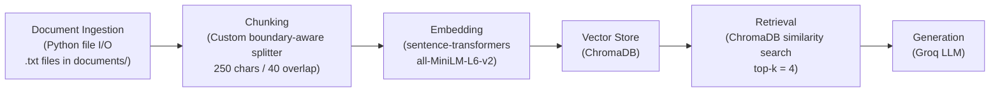

# Project 1 Planning: The Unofficial Guide

> Write this document before you write any pipeline code.
> Your spec and architecture diagram are what you'll use to direct AI tools (Claude, Copilot, etc.) to generate your implementation — the more specific they are, the more useful the generated code will be.
> Update the Retrieval Approach and Chunking Strategy sections if you change your approach during implementation.
> Update this file before starting any stretch features.

---

## Domain

<!-- What domain did you choose? Why is this knowledge valuable and hard to find through official channels? -->

This project is an unofficial guide to housing and commuting for Hunter College
students, especially students deciding between Hunter-affiliated housing,
off-campus housing, and commuting from another part of New York City. It will
help answer practical questions about housing availability, neighborhoods,
roommates, transit routes, commute tradeoffs, rental safety, and tenant rights.

This knowledge is difficult to find in one place. Hunter College and the MTA
publish authoritative information about residences, campus locations, and
transit routes, but they do not capture students' firsthand experiences with
long commutes, housing waitlists, roommate searches, summer closures, or the
tradeoffs between cost and convenience. Those details are scattered across
official pages, Reddit threads, and New York City housing resources.

---

## Documents

<!-- List your specific sources: URLs, subreddit names, forum threads, or file descriptions.
     Aim for at least 10 sources that together cover different subtopics or perspectives within your domain. -->

| # | Source | Description | URL or location |
|---|--------|-------------|-----------------|
| 1 | Hunter College Housing | Official overview of Hunter-affiliated residences, limited availability, and the housing application process. | https://www.hunter.cuny.edu/students/campus-life/residence-life/ |
| 2 | Hunter College 68th Street Campus | Official campus location and directions by subway and bus, including the direct entrance from the 68th Street station. | https://www.hunter.cuny.edu/about/campus-information/68th-street-campus/ |
| 3 | CUNY Residence Life | CUNY-wide residence options, eligibility information, and housing resources available to students. | https://www.cuny.edu/about/administration/offices/student-affairs/programs-services/housing-residence-life/ |
| 4 | MTA 6 Train Line Map | Official list of 6 train stops and transfer points, including 68 St-Hunter College. | https://www.mta.info/maps/subway-line-maps/6-line |
| 5 | MTA Maps | Official subway, accessibility, late-night, and borough bus maps for comparing possible commutes. | https://www.mta.info/maps |
| 6 | "Best way to go about housing while at Hunter?" | Hunter student discussion about moving closer to campus, residence photos, and how to begin a housing search. | https://www.reddit.com/r/HunterCollege/comments/1d4s1es/ |
| 7 | "Off campus student housing" | Student experiences with Hunter housing, third-party student housing, apartment costs, and finding roommates. | https://www.reddit.com/r/HunterCollege/comments/1ggxot5/ |
| 8 | "51st midtown dorms, 79th dorms, and outside housing" | Discussion comparing Hunter residences with outside housing, including summer availability and roommate-search options. | https://www.reddit.com/r/HunterCollege/comments/1jq6ewe/ |
| 9 | "Best option for housing as a very low income student?" | Student discussion of financial aid, housing costs, roommates, and the burden of a two-hour commute. | https://www.reddit.com/r/HunterCollege/comments/1imttmj/ |
| 10 | "How is commute to Hunter" | Firsthand comments about commute length, the 6 train, and studying during longer trips. | https://www.reddit.com/r/HunterCollege/comments/1h0sblm/ |
| 11 | NYC Tenant Bill of Rights | Official guidance on application fees, security deposits, leases, housing quality, evictions, and landlord harassment. | https://www.nyc.gov/site/hpd/services-and-information/tenant-bill-of-rights.page |
| 12 | Spot an Illegal Conversion | Official NYC warning signs for unsafe or illegally converted rental units. | https://www.nyc.gov/site/buildings/tenant/spot-illegal-conversion.page |

---

## Chunking Strategy

<!-- How will you split documents into chunks?
     State your chunk size (in tokens or characters), overlap size, and explain why those
     numbers fit the structure of your documents.
     A review-heavy corpus warrants different chunking than a long FAQ. -->

**Chunk size:** 250 characters

**Overlap:** 40 characters

**Reasoning:** The corpus is mixed: Reddit comments are short, while official pages and NYC government guides contain longer paragraphs and lists. Initial retrieval testing with 200-character chunks returned the correct sources but sometimes omitted the sentence that directly answered the query. Increasing the target to 250 characters preserves more complete ideas while still producing more than 50 chunks across the corpus. A 40-character overlap prevents context from being lost at boundaries without duplicating too much text. The custom `chunk_text()` function prefers paragraph breaks, newlines, sentence endings, and word boundaries before using a hard character cut.

---

## Retrieval Approach

<!-- Which embedding model are you using (e.g., all-MiniLM-L6-v2 via sentence-transformers)?
     How many chunks will you retrieve per query (top-k)?
     If you were deploying this for real users and cost wasn't a constraint, what tradeoffs
     would you weigh in choosing a different embedding model — context length, multilingual
     support, accuracy on domain-specific text, latency? -->

**Embedding model:** all-MiniLM-L6-v2 via sentence-transformers

**Top-k:** 4

**Production tradeoff reflection:** all-MiniLM-L6-v2 is fast and lightweight but was trained on general text, not housing or transit data. For a real deployment, a model with a longer context window (e.g., text-embedding-3-large from OpenAI) would handle longer official documents better. A multilingual model would matter if serving non-English-speaking Hunter students. The tradeoff is latency and cost: larger models produce better embeddings but are slower and more expensive to run at scale. For this project, all-MiniLM-L6-v2 is appropriate because the queries and documents are short and in English.

---

## Evaluation Plan

<!-- List your 5 test questions with their expected correct answers.
     Questions should be specific enough that you can judge whether the system's response
     is right or wrong. "What are good dining halls?" is too vague.
     "What do students say about wait times at [dining hall name] during lunch?" is testable. -->

| # | Question | Expected answer |
|---|----------|-----------------|
| 1 | Which subway line stops directly at Hunter College's main 68th Street campus? | The 6 train stops at 68 St-Hunter College, and the station has an entrance directly into the college. |
| 2 | Is Hunter-affiliated housing guaranteed to students? | No. Hunter has limited housing for a student population of more than 22,000, so housing is competitive, not guaranteed, and students must reapply each year. |
| 3 | What alternatives do students discuss when Hunter housing is unavailable or too expensive? | Students commonly discuss sharing an off-campus apartment with roommates, searching roommate groups or services, and considering third-party student housing. |
| 4 | What should a student consider before choosing a long commute instead of housing near Hunter? | They should compare rent and housing costs with total travel time, transit reliability, transfers, schedule demands, and the academic and personal burden of spending several hours commuting each day. |
| 5 | What rental warning signs can indicate an illegal or unsafe NYC apartment? | Warning signs include a suspiciously low price, basement or attic rooms with inadequate exits or windows, unpermitted flex walls, cash-only arrangements, no written lease, and a landlord unwilling to place utilities in the tenant's name. |

---

## Anticipated Challenges

<!-- What could go wrong? Name at least two specific risks with reasoning.
     Consider: noisy or inconsistent documents, missing source attribution, off-topic
     retrieval, chunks that split key information across boundaries. -->

1. **Contradictory or outdated Reddit advice retrieved with false confidence.** Reddit threads contain opinions from students at different points in time, some of which may be outdated or simply wrong. The embedding model retrieves these chunks with the same confidence as accurate official information, so the LLM treats them as ground truth and generates answers with false confidence. Mitigation: tag chunks with source type (official vs. Reddit) as metadata and use it to signal provenance in the prompt so the LLM can qualify its answers accordingly.

2. **Enumerated lists split across chunk boundaries produce incomplete answers.** The NYC tenant warning signs list and similar structured content can be divided across multiple 250-character chunks. If only one chunk lands in the top-four retrieved results, the user may receive only part of the list. Mitigation: inspect retrieval for list-style questions and increase top-k when evaluation shows that relevant adjacent chunks are being omitted.

---

## Architecture

---

## AI Tool Plan

<!-- For each part of the pipeline below, describe:
     - Which AI tool you plan to use (Claude, Copilot, ChatGPT, etc.)
     - What you'll give it as input (which sections of this planning.md, which requirements)
     - What you expect it to produce
     - How you'll verify the output matches your spec

     "I'll use AI to help me code" is not a plan.
     "I'll give Claude my Chunking Strategy section and ask it to implement chunk_text()
     with my specified chunk size and overlap" is a plan. -->

**Milestone 3 — Ingestion and chunking:**
- AI tool: Claude
- Input: Chunking Strategy section (custom boundary-aware splitting with chunk size 250 and overlap 40) and Architecture diagram (shows `.txt` files in the `documents/` folder)
- Expected output: `load_documents(folder_path)` that reads all source `.txt` files and returns each document's cleaned text with its filename, title, source type, and URL as metadata; `chunk_text(text)` and `build_chunks()` functions that prefer paragraph, newline, sentence, and word boundaries while applying the specified size and overlap
- Verification: Confirm that all 12 source documents load, print one cleaned document, count the chunks, and inspect five random chunks for readable content, correct source metadata, no empty strings, and no HTML artifacts. The current pipeline produces 54 chunks, which is within the recommended 50–2,000 range.

**Milestone 4 — Embedding and retrieval:**
- AI tool: Claude
- Input: Retrieval Approach section (all-MiniLM-L6-v2, ChromaDB, top-k=4) and Architecture diagram
- Expected output: `embed_and_store(chunks)` that encodes chunks with sentence-transformers and stores them in a persistent ChromaDB collection with source filename, title, URL, source type, and chunk position metadata; `retrieve(query, k=4)` that embeds a query and returns the top-four most similar chunks with cosine distance scores
- Verification: Run at least three questions from the Evaluation Plan, print all returned chunks with their source metadata and distances, and confirm that the results visibly relate to each question. Top results should have cosine distances below 0.5 before proceeding to generation.

**Milestone 5 — Generation and interface:**
- AI tool: Claude
- Input: Domain section, Evaluation Plan, grounding requirement, desired answer-plus-source-list format, retrieval module, and Gradio interface structure
- Expected output: `ask(question)` that retrieves four chunks, rejects weak retrieval above a 0.50 cosine-distance threshold, sends only retrieved context to Groq's `llama-3.3-70b-versatile`, and returns an answer with programmatically generated source metadata; a Gradio interface with a question box, answer panel, and clickable source list
- Verification: Run two or three supported evaluation questions and confirm every claim is traceable to a retrieved excerpt. Ask an unsupported dining question and confirm the system responds, "I don't have enough information on that," without calling Groq. Verify that source titles and URLs are appended from ChromaDB metadata rather than relying only on model-generated citations.
